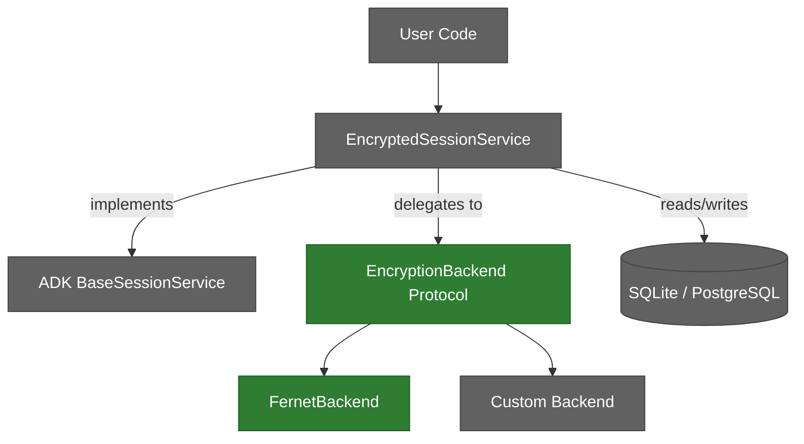
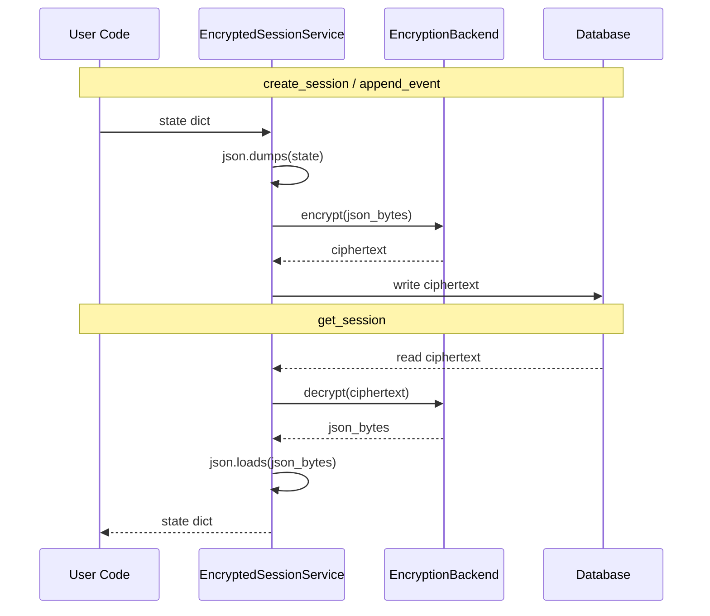
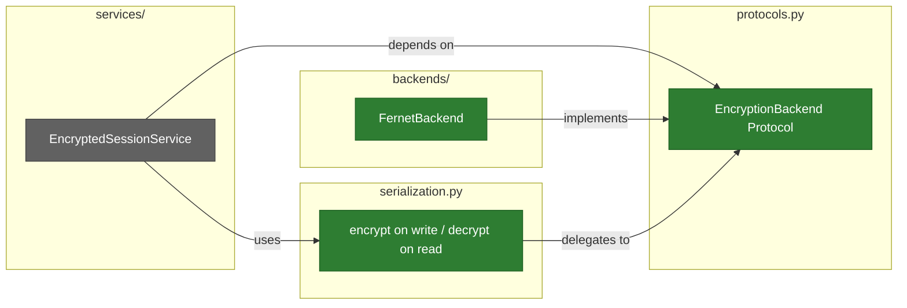

# Architecture

## Overview

adk-secure-sessions directly implements ADK's `BaseSessionService` ABC and adds encryption at the JSON serialization boundary. Encryption backends are pluggable via the `EncryptionBackend` protocol (PEP 544).

!!! info "Color Legend"
    - **Green** — Implemented and tested
    - **Gray** — Planned (see [Roadmap](ROADMAP.md))

## Data Flow

Session data is encrypted at the JSON serialization boundary — after serialization on write, before deserialization on read.

## Encryption Boundary

Field-level encryption protects sensitive data while keeping metadata queryable.

| Data | Encrypted | Rationale |
|------|-----------|-----------|
| `state` values (user_state, app_state, session_state) | Yes | Contains sensitive user/app data |
| `events` (conversation history) | Yes | Contains user messages, tool outputs, PII |
| `session_id`, `app_name`, `user_id` | No | Needed for lookups and filtering |
| `create_time`, `update_time` | No | Needed for expiration and cleanup |

## Package Structure

### Layer Rules

1. **`services/`** depends on `protocols.py` (the contract), never on concrete backends
2. **`backends/`** implements `protocols.py` — each backend is self-contained
3. **`protocols.py`** has zero dependencies (stdlib `typing` only)
4. **`serialization.py`** handles the encrypt-on-write / decrypt-on-read boundary

## Current State

**Implemented:**

- **`protocols.py`** — `EncryptionBackend` protocol with `encrypt`/`decrypt` async methods, `@runtime_checkable`
- **`backends/fernet.py`** — `FernetBackend` using Fernet symmetric encryption with PBKDF2 key derivation
- **`exceptions.py`** — `SecureSessionError` base, `EncryptionError`, `DecryptionError`, `SerializationError`
- **`serialization.py`** — `encrypt_session`, `decrypt_session`, `encrypt_json`, `decrypt_json` with self-describing `[version][backend_id][ciphertext]` envelope format
- **`__init__.py`** — Exports all public symbols (protocols, backends, exceptions, serialization functions, constants)

**Planned** (see [Roadmap](ROADMAP.md)):

- `EncryptedSessionService`

## Design Decisions

See the [Architecture Decision Records](adr/index.md) for detailed rationale:

| ADR | Decision |
|-----|----------|
| [ADR-000](adr/ADR-000-strategy-decorator-architecture.md) | Direct implementation of `BaseSessionService`, not a decorator |
| [ADR-001](adr/ADR-001-protocol-based-interfaces.md) | `typing.Protocol` over ABC for backend interfaces |
| [ADR-002](adr/ADR-002-async-first.md) | Async-first design matching ADK's runtime |
| [ADR-003](adr/ADR-003-field-level-encryption.md) | Field-level encryption as default, not full-database |
| [ADR-004](adr/ADR-004-adk-schema-compatibility.md) | Own schema, no coupling to ADK internals |
| [ADR-005](adr/ADR-005-exception-hierarchy.md) | Focused exception hierarchy |
