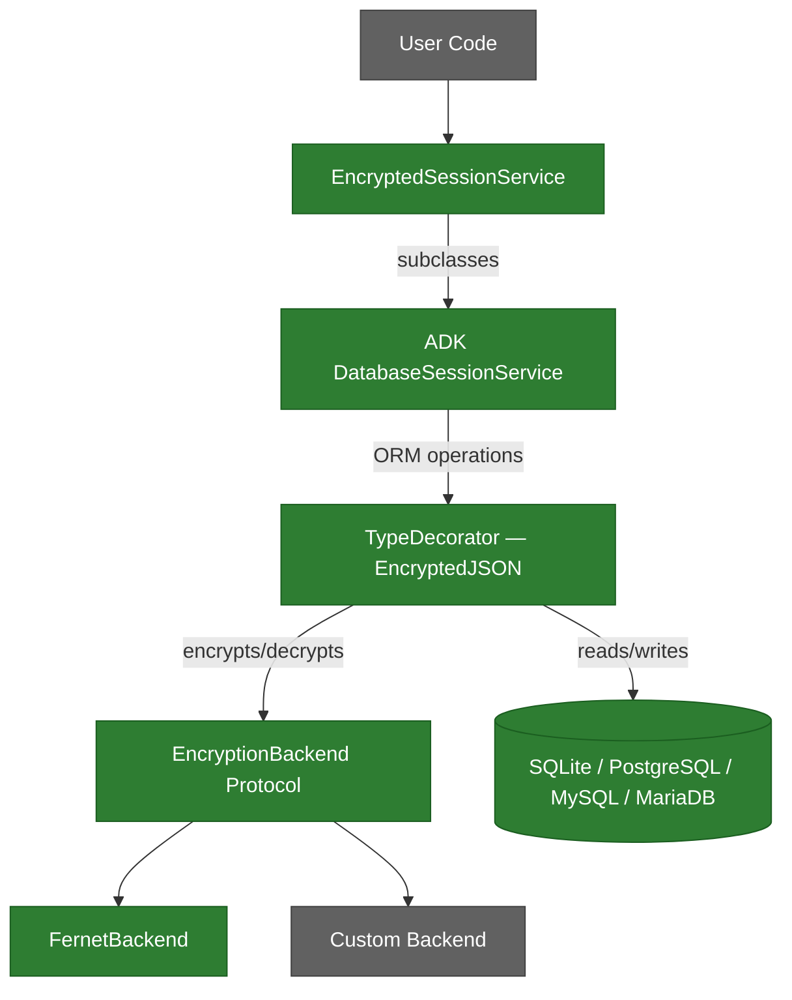
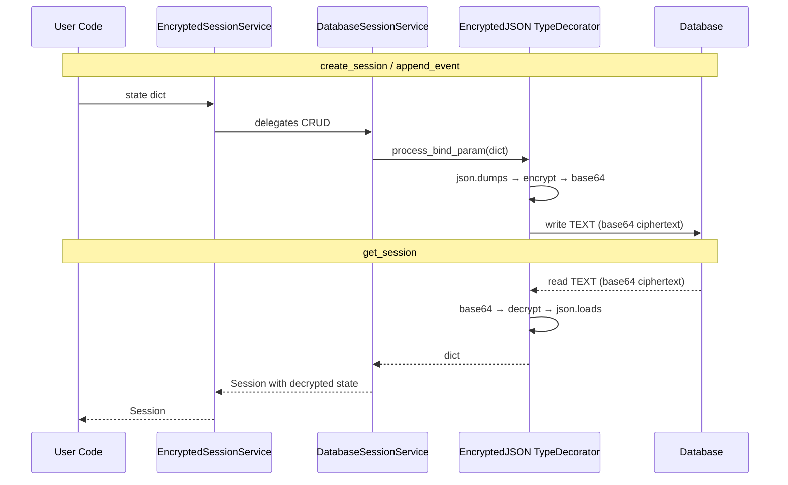
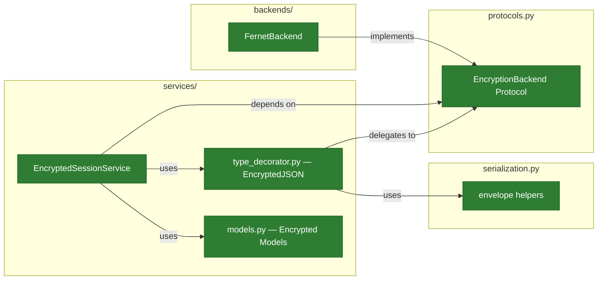

# Architecture

## Overview

adk-secure-sessions wraps ADK's `DatabaseSessionService` with transparent encryption via a custom SQLAlchemy `TypeDecorator` (`EncryptedJSON`). Encryption backends are pluggable via the `EncryptionBackend` protocol (PEP 544). See [ADR-007](adr/ADR-007-architecture-migration.md) for the migration decision record.

!!! info "Color Legend"
    - **Green** — Implemented and tested
    - **Gray** — Planned (see [Roadmap](ROADMAP.md))

## Data Flow

Encryption is transparent at the ORM boundary. The `EncryptedJSON` TypeDecorator intercepts SQLAlchemy's `process_bind_param` (write) and `process_result_value` (read), so `DatabaseSessionService` operates on plaintext dicts while the database stores only ciphertext.

## Encryption Boundary

Field-level encryption protects sensitive data while keeping metadata queryable.

| Data | Encrypted | Rationale |
|------|-----------|-----------|
| `state` values (user_state, app_state, session_state) | Yes | Contains sensitive user/app data |
| `events` (conversation history) | Yes | Contains user messages, tool outputs, PII |
| `session_id`, `app_name`, `user_id` | No | Needed for lookups and filtering |
| `create_time`, `update_time` | No | Needed for expiration and cleanup |

## Package Structure

### Layer Rules

1. **`services/`** depends on `protocols.py` (the contract), never on concrete backends
2. **`backends/`** implements `protocols.py` — each backend is self-contained
3. **`protocols.py`** has zero dependencies (stdlib `typing` only)
4. **`serialization.py`** handles the encrypt-on-write / decrypt-on-read boundary

## Current State

**Implemented:**

- **`protocols.py`** — `EncryptionBackend` protocol with `encrypt`/`decrypt` async methods, `@runtime_checkable`
- **`backends/fernet.py`** — `FernetBackend` using Fernet symmetric encryption with PBKDF2 key derivation
- **`exceptions.py`** — `SecureSessionError` base, `EncryptionError`, `DecryptionError`, `SerializationError`, `ConfigurationError`
- **`serialization.py`** — Envelope helpers (`_build_envelope`, `_parse_envelope`) and constants for the `[version][backend_id][ciphertext]` format ([see Envelope Protocol Specification](envelope-protocol.md))
- **`services/type_decorator.py`** — `EncryptedJSON` TypeDecorator that transparently encrypts/decrypts at the SQLAlchemy ORM boundary
- **`services/models.py`** — Encrypted SQLAlchemy model classes replacing ADK's `DynamicJSON` with `EncryptedJSON`
- **`services/encrypted_session.py`** — `EncryptedSessionService` wrapping ADK's `DatabaseSessionService` with:
  - All CRUD operations (`create_session`, `get_session`, `list_sessions`, `delete_session`) delegated to `DatabaseSessionService`
  - Transparent encryption via `EncryptedJSON` TypeDecorator on state and event data columns
  - Multi-database support (SQLite, PostgreSQL, MySQL, MariaDB) via `DatabaseSessionService`'s dialect handling
- **`__init__.py`** — Exports all public symbols (protocols, backends, exceptions, serialization functions, services, constants)

**Planned** (see [Roadmap](ROADMAP.md)):

- Key rotation support
- AES-256-GCM encryption backend
- KMS backends (AWS, GCP, HashiCorp Vault)

## Design Decisions

See the [Architecture Decision Records](adr/index.md) for detailed rationale:

| ADR | Decision |
|-----|----------|
| [ADR-000](adr/ADR-000-strategy-decorator-architecture.md) | Strategy + direct implementation (partially superseded by ADR-007) |
| [ADR-001](adr/ADR-001-protocol-based-interfaces.md) | `typing.Protocol` over ABC for backend interfaces |
| [ADR-002](adr/ADR-002-async-first.md) | Async-first design matching ADK's runtime |
| [ADR-003](adr/ADR-003-field-level-encryption.md) | Field-level encryption as default, not full-database |
| [ADR-004](adr/ADR-004-adk-schema-compatibility.md) | Own schema, no coupling to ADK internals (narrowed by ADR-007) |
| [ADR-005](adr/ADR-005-exception-hierarchy.md) | Focused exception hierarchy |
| [ADR-007](adr/ADR-007-architecture-migration.md) | Architecture migration — DatabaseSessionService wrapping via TypeDecorator |
