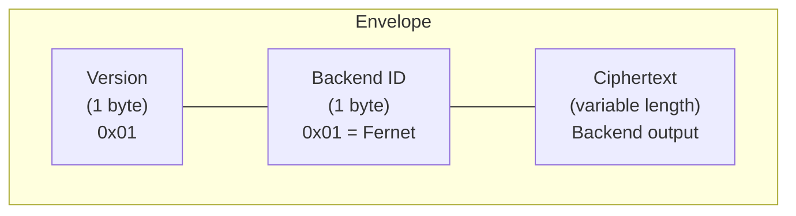

# Envelope Protocol Specification

Every piece of encrypted data produced by adk-secure-sessions is wrapped in a
self-describing **envelope**. The envelope is a binary wire protocol that
prefixes the ciphertext with a version byte and a backend identifier, making
every blob of encrypted data independently identifiable without external
metadata.

This page is the canonical reference for the envelope format. For the design
rationale behind the envelope, see
[ADR-000](adr/ADR-000-strategy-decorator-architecture.md). For details on the
encryption algorithms used by each backend, see
[Algorithm Documentation](algorithms.md).

## Binary Layout

The envelope is a byte sequence with the following structure:

| Byte Position | Field | Size | Description |
|---------------|-------|------|-------------|
| 0 | Version | 1 byte | Envelope format version (`0x01` for v1) |
| 1 | Backend ID | 1 byte | Identifies the encryption backend (Fernet = `0x01`) |
| 2 .. N | Ciphertext | Variable | Output of the backend's `encrypt()` method |

**Total envelope size:** `len(ciphertext) + 2` bytes.

**Minimum valid envelope:** 3 bytes (1 version + 1 backend ID + at least 1 byte
of ciphertext), enforced by the `_MIN_ENVELOPE_LENGTH` constant.



### Build and Parse

The serialization layer provides two internal functions for envelope
construction and validation:

- **`_build_envelope(version, backend_id, ciphertext)`** — concatenates the
  header bytes and ciphertext: `bytes([version, backend_id]) + ciphertext`.
- **`_parse_envelope(envelope)`** — validates the envelope and returns
  `(version, backend_id, ciphertext)`. Raises `DecryptionError` if validation
  fails.

## Backend ID and Dispatch

The backend ID byte at position 1 identifies which encryption backend produced
the ciphertext. In the current implementation (v1), the following backends are
registered:

| Backend ID | Name | Module |
|------------|------|--------|
| `0x01` | Fernet | `adk_secure_sessions.backends.fernet` |

### v1 Dispatch Behavior

In v1, `_parse_envelope()` reads the backend ID and **validates** it against
`BACKEND_REGISTRY` to confirm the envelope is well-formed. However, the backend
ID is **not** used for automatic dispatch. The caller provides the backend
explicitly when calling `decrypt_session()` or `decrypt_json()`:

```python
# The caller passes the backend — the envelope ID validates, not dispatches
state = await decrypt_session(envelope, backend)
```

Internally, `decrypt_session()` discards the parsed backend ID after
validation:

```python
_version, _backend_id, ciphertext = _parse_envelope(envelope)
```

The underscore-prefixed variables indicate the values are validated but unused
for dispatch. The backend ID enables **future** automatic dispatch (Phase 3,
Story 3.3) where the system reads the ID and selects the correct backend
without caller intervention.

## Error Handling

`_parse_envelope()` raises `DecryptionError` for three categories of invalid
envelopes:

| Condition | Error Message |
|-----------|---------------|
| Envelope shorter than 3 bytes | `"Envelope too short: expected at least 3 bytes"` |
| Unrecognized version byte | `"Unsupported envelope version: {version}"` |
| Unrecognized backend ID | `"Unsupported encryption backend: {backend_id}"` |

All three checks run before any decryption is attempted, providing fast failure
for corrupted or unsupported data.

## Extensibility

New encryption backends integrate by:

1. **Assigning a unique byte ID** — choose the next available value (e.g.,
   `0x02` for AES-256-GCM).
2. **Registering in `BACKEND_REGISTRY`** — add the mapping
   `{new_id: "BackendName"}` so `_parse_envelope()` accepts the ID.
3. **Implementing `EncryptionBackend`** — the new backend must conform to the
   `EncryptionBackend` protocol (two async methods: `encrypt` and `decrypt`).

The envelope format requires no changes — the version byte and backend ID
structure accommodates up to 255 backends per version.

## Migration Enablement

The envelope format is what makes zero-downtime backend migration possible.
When a new backend is introduced (e.g., AES-256-GCM in Phase 3):

- **Existing data** retains its original backend ID. Envelopes written with
  Fernet (`0x01`) remain readable as long as the Fernet backend is registered.
- **New data** is written with the new backend ID (e.g., `0x02`). The envelope
  header immediately identifies which backend produced the ciphertext.
- **Mixed-backend reads** work because each envelope is self-describing. The
  system can read old Fernet envelopes and new AES-256-GCM envelopes from the
  same database without ambiguity.

This is distinct from backend extensibility (how to register a new backend).
Migration enablement is about how old and new backends **coexist at runtime**
during a transition period, avoiding a stop-the-world re-encryption step.

Automatic dispatch based on the backend ID byte (Phase 3, Story 3.3) will
complete this picture by routing each envelope to the correct backend without
caller intervention.

## Related

- [ADR-000: Strategy + Direct Implementation Architecture](adr/ADR-000-strategy-decorator-architecture.md) — design rationale for the envelope as a wire protocol
- [Algorithm Documentation](algorithms.md) — encryption algorithms used by registered backends
- [Architecture Overview](ARCHITECTURE.md) — system-level view of the encryption boundary
